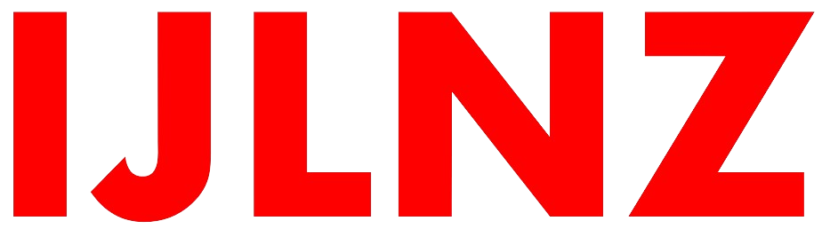

  

# public-media

A public, open-source collection of media assets curated and maintained by **IJLNZ** for use in **events, campaigns, and creative projects** - both by us and our clients.

All content is openly licensed (CC0 / public domain) for reuse, remixing, and redistribution.

---

## Table of Contents

- [About](#about)  
- [Usage by IJLNZ and Clients](#usage-by-ijlnz-and-clients)  
---

## About

The **public-media** repository serves as a shared library of open media files - videos, images, audio clips, and design elements - made freely available for creative and event-based use.  

The goal is to support **open collaboration and transparent reuse** of visual and audio material, without the legal or licensing friction that typically comes with proprietary content.

---

## Usage by IJLNZ and Clients

IJLNZ and our partners use this media collection as a **foundation for event production, public communications, and brand activations**.  
It supports a wide range of use cases:

- Visual assets for **event screens, digital signage, and livestream overlays**.
- Audio beds, stingers, and background loops for **presentations or broadcasts**.
- Graphic materials and stills for **press kits, web embeds, and social media**.
- Openly licensed material that clients can **reuse or adapt** for their own projects.

This open-source approach ensures **creative flexibility, transparency, and accessibility** - allowing collaborators and audiences alike to build on shared creative work.

---
